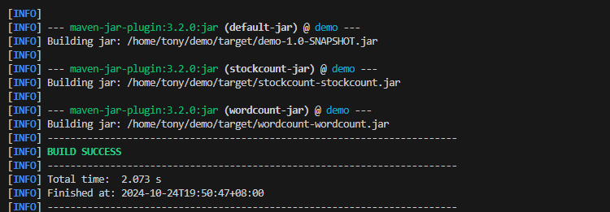

# bigdata
#
代码结构如下：
bigdata/
├── pom.xml
└── src
    └── main
        └── java
            └── com
                └── example
                    ├── StockCount.java
                    └── WordCount.java
为了方便，将jar文件分别拷贝到xml文件同目录的jarfile

结果分别存储在result文件夹

